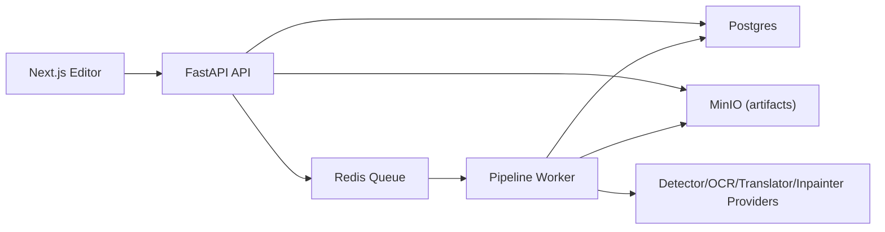

# Manga Translate Studio

Portfolio-sized comic translation system with persistent projects, async pipeline jobs, pluggable model providers, and a browser editor.

## Architecture



- API endpoints create/read/cancel jobs and persist project/page/session metadata.
- Worker consumes Redis queue, runs stage-based orchestrator, writes artifacts to MinIO, updates DB.
- Editor restores last session and region state after refresh.

## Core Features

- Persistent sessions:
  - `GET /api/v1/me/last-session`
  - `POST /api/v1/me/last-session`
- Async pipeline:
  - queued/running/retrying/done/failed/canceled statuses
  - retries + dead-letter
  - stale running recovery on worker startup
  - cancel endpoint (`POST /api/v1/pipeline/jobs/{id}/cancel`)
- Provider plugin model:
  - registry in `apps/api/providers.yaml`
  - stage config per job: detector/inpainter/ocr/translator
  - provider health endpoint: `GET /api/v1/providers`
- Batch workflow:
  - queue all pages from editor
  - project progress endpoint: `GET /api/v1/projects/{project_id}/progress`
- Exports:
  - server ZIP export: `GET /api/v1/projects/{project_id}/export.zip`
  - includes images + metadata JSON with provider/model/version per stage

## Repository Layout

- `/apps/api` FastAPI app + worker
- `/apps/web` Next.js editor
- `/infra/docker-compose.yml` local stack

## Local Run

```bash
cp .env.example .env
mkdir -p apps/api/models
cp ~/Downloads/best-3.pt apps/api/models/best-3.pt
make up
```

- Web: `http://localhost:3300/editor`
- API docs: `http://localhost:8100/docs`

## Make Targets

- `make up` start stack in background
- `make down` stop stack
- `make logs` tail logs
- `make migrate` apply DB migrations
- `make seed` seed demo data
- `make test` run API tests

## API Highlights

- Jobs:
  - `POST /api/v1/pipeline/jobs`
  - `GET /api/v1/pipeline/jobs/{job_id}`
  - `POST /api/v1/pipeline/jobs/{job_id}/cancel`
  - `GET /api/v1/pipeline/jobs/{job_id}/events`
- Projects:
  - `GET /api/v1/projects/{project_id}/progress`
  - `GET /api/v1/projects/{project_id}/export.zip`
  - `GET /api/v1/projects/{project_id}/pages/{page_id}/regions`
  - `PATCH /api/v1/projects/{project_id}/pages/{page_id}/regions/{region_id}`
- Providers:
  - `GET /api/v1/providers`
- Session:
  - `GET /api/v1/me/last-session`
  - `POST /api/v1/me/last-session`

## Adding a Custom Provider

1. Register provider metadata in `apps/api/providers.yaml`:
   - `enabled`
   - supported `stages`
   - default `model`/`version`
   - `capabilities`
2. Implement stage logic in `apps/api/app/services/pipeline_orchestrator.py` adapter layer:
   - `DetectorProvider.detect`
   - `InpainterProvider.inpaint`
   - `OcrProvider.ocr`
   - `TranslatorProvider.translate`
3. Expose provider name in selector UI (`EditorWorkbench` pipeline config panel).

## Observability

- Metrics: `/metrics`
  - queue length
  - running jobs
  - retry/dead-letter counters
  - stage duration and failures by provider
- Structured worker logs include:
  - `job_id`, `project_id`, `request_id`, `provider`

## Security Baseline

- JWT auth on project/job/session endpoints.
- Project ownership checks on all project/page/region access.
- Upload validation:
  - MIME type
  - magic bytes
  - size and pixel limits
- Rate limiting for sensitive endpoints.

## Troubleshooting

- `Pipeline provider circuit is open`:
  - wait for reset window (`PIPELINE_CIRCUIT_RESET_SEC`) or reduce failing requests.
- first custom translation is slow:
  - NLLB model warm-up can take minutes on first run.
- no output preview:
  - verify worker logs and `output_*_s3_key` in job status.
- session not restoring:
  - confirm `POST /me/last-session` succeeds (JWT + owner access).

## Non-goals (current iteration)

- No Kubernetes
- No distributed tracing stack
- No full EPUB/PDF production pipeline (ZIP export only)
